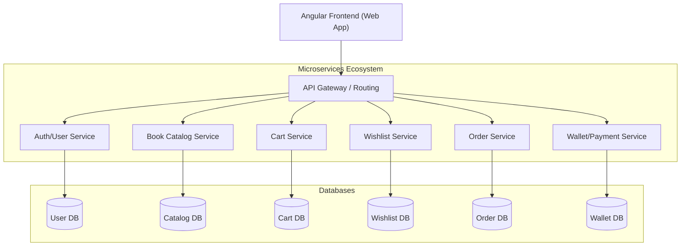
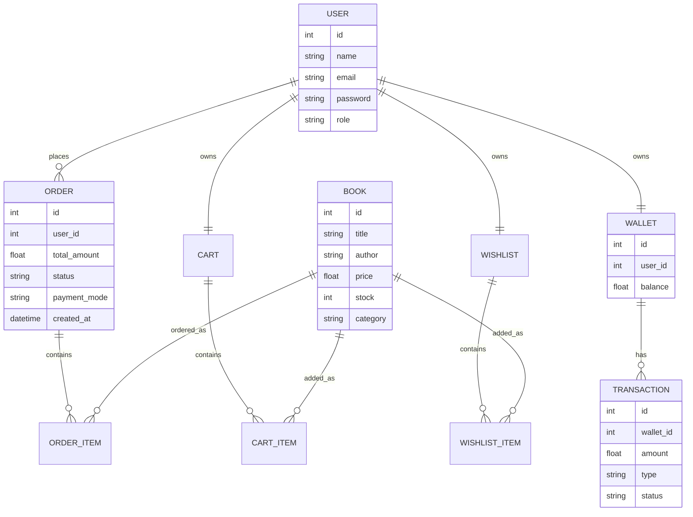
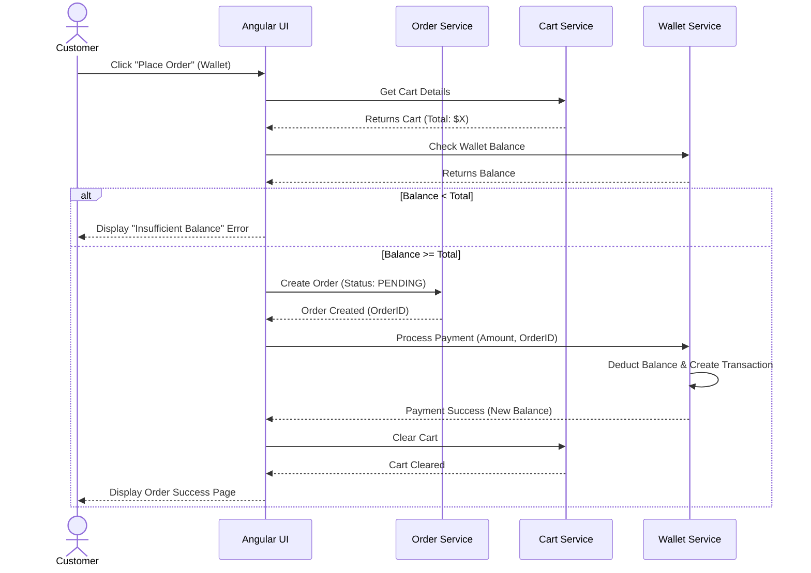
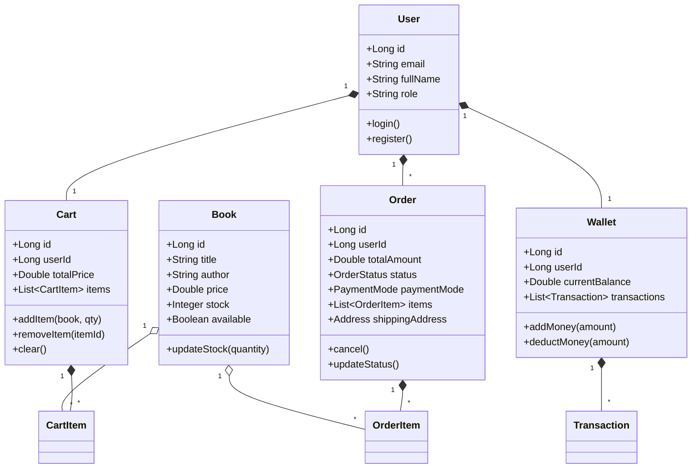

# BookNest E-Commerce Platform - Design Documents

## 1. Actors & Functionalities

### Actors
* **Customer:** A registered or guest user who browses books, manages their cart, maintains a wishlist, and places orders.
* **Admin:** A privileged user responsible for managing the book catalog, viewing all orders, and managing user accounts.
* **System (Automated Tasks):** Background processes for inventory management, wallet deductions, and order status updates.

### Core Functionalities
* **Authentication & Authorization:** User registration, login, role-based access control (Admin vs Customer).
* **Catalog Management:** Browse books, search, filter, and view details (Admin can Add/Edit/Delete books).
* **Cart Management:** Add/Remove items, update quantities, calculate subtotals.
* **Wishlist Management:** Save books for later, move to cart.
* **Wallet System:** Check balance, top-up wallet, view transaction history, process payments.
* **Order Management:** Place orders (Cash on Delivery or Wallet), view order history, cancel orders (Admin can update order status).

---

## 2. Architectural Diagram

---

## 3. Database Entity-Relationship (ER) Diagram

---

## 4. Sequence Diagram: Checkout Flow (Wallet Payment)

---

## 5. High-Level Class Diagram

